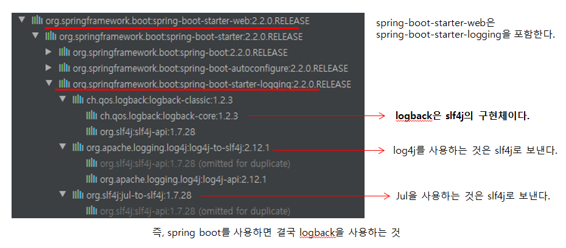

# 스프링 부트 로거    

  
  
  
<b> 스프링 부트 로깅 </b>  
* --debug (embedded container, Hibernate, Spring Boot만 디버깅 모드로 찍힘)  
* --trace (전부 다 디버깅 모드로)  
* 컬러 출력: spring.output.ansi.enabled  
* 파일 출력: logging.file(파일명) 또는 logging.path(파일 경로)  
* 로그 레벨 조정(패키지별 로그 레벨지정): logging.level.패키지 = 로그 레벨

 

<b> 커스텀 로그 </b>  

* 커스텀 로그를 위해 logback을 사용하고자 할 때, logback.xml보다 logback-spring.xml을 추천한다.  
  --> 이유는? logback.xml과 같지만, spring boot가 추가 기능을 제공한다.  
      logback 설정 파일안에서 profile이나 enviroment variable을 사용할 수 있다.  

 

spring boot는 기본적으로는 logback 사용. <b> logback말고 log4j2로 변경하고 싶을 땐?? </b>

~~~xml
<dependency>
    <groupId>org.springframework.boot</groupId>
    <artifactId>spring-boot-starter</artifactId>
    <exclusions>
        <exclusion>
            <groupId>org.springframework.boot</groupId>
            <artifactId>spring-boot-starter-logging</artifactId>
        </exclusion>
    </exclusions>
</dependency>
<dependency>
    <groupId>org.springframework.boot</groupId>
    <artifactId>spring-boot-starter-log4j2</artifactId>
</dependency>
~~~
